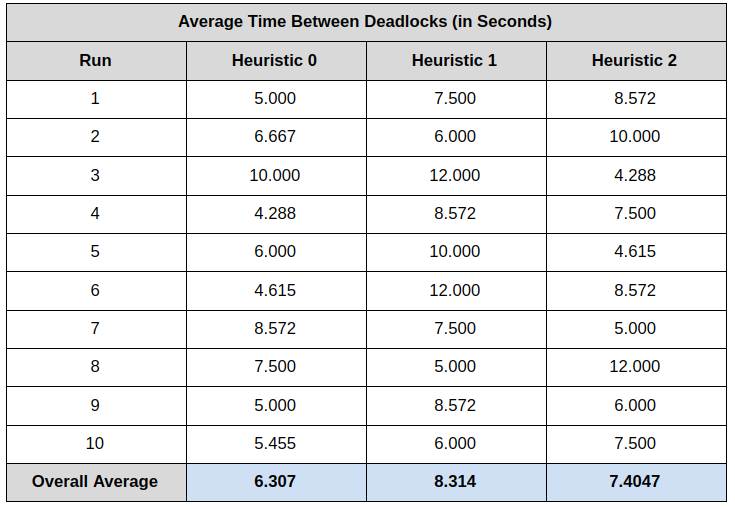

# Deadlock-Detection-in-an-OS
A C program to detect deadlocks among threads with access to shared resources, terminating the required threads based on a set of heuristics, and further comparing the performance of these heuristics. 
<h4>What does the program do?</h4>
The program mimics the functioning of a deadlock detection system in an operating system. At fixed intervals, a separate thread carries out the detection procedure based on Banker's Algorithm. While in the non-detection phase, different threads (mimicking processes & sub-processes) acquire (one at a time) or release resources (after all requirements met, all at once), with random pauses in between. Once a deadlock is detected, the system is inspected, and the threads involved in the deadlock (based on different heuristics) are terminated, and new ones are spawned in their place. 
<h4>Working of the Program</h4>
Initially, a set of threads (number specified by the user) are started with a random requirement of resources (bounded by the maximum resources available), and they continuously acquire resources one at a time, sleeping after each acquisition.  
In case a thread’s requirement is fulfilled, it releases all its resources (all at once) and then sets a new random requirement for itself.  
Meanwhile in the background, a separate deadlock detection thread runs, becoming active after a sleep interval (again, user specified), and checks for deadlocks using Banker’s Algorithm. In case a deadlock is detected, it terminates all the threads involved in the deadlock (after releasing their resources), and spawns new threads with new requirements in their place.  
The user also specifies a time out interval, after which the code exits and the average time between deadlocks is printed (can also be terminated early by user interrupt).  
The implementation of Banker’s Algorithm works as follows: 
<ul><li>Initially, two arrays called <i>work</i> & <i>finish</i> are initialized, with sizes of the number of resources and number of threads respectively. The <i>work</i> array is like an abstraction of the available resources, when forward tracking using the algorithm. The <i>finish</i> array keeps track of the threads who’s requirements can potentially be fulfilled while running the algorithm.</li>
<li>Firstly, all the threads who’s requirements are already fulfilled are marked as finished (in the finish array) and their allocated resources are added to the <i>work</i> array.</li>
<li>Then threads satisfying the following requirements are chosen:
  <ol><li><i>Requirement[thread i] <= work</i></li>
    <li><i>Finish[thread i] = false</i></li></ol></li>
<li>For these threads, their current allocated resources are added to the <i>work</i> array and are marked as finished in the <i>finish</i> array. This process is repeated until no such thread is left satisfying those conditions (mentioned above).</li>
<li>Then, the <i>finish</i> array is scanned, and if any thread is not marked as finished, then the system is said to be deadlocked and the threads that are marked unfinished are the threads involved in the deadlock (and are to be terminated).</li></ul>
Three different heuristics are used to terminate threads in case a deadlock occurs. They can be explained as below: 
<ul><li><b>Heuristic 0</b>: This heuristic covers the most standard case of Banker’s Algorithm. Here, all the threads marked as unfinished in the <i>finish</i> array at the end of Banker’s Algorithm are terminated, and new threads with new requirements are spawned in their place.</li>
<li><b>Heuristic 1</b>: In this heuristic, the thread found to be having maximum resources overall, as well as being marked unfinished in the <i>finish</i> array is terminated and Banker’s Algorithm is run again after updating the <i>work</i> and <i>finish</i> array.</li>
<li><b>Heuristic 2</b>: This heuristic is similar to Heuristic 1 except for the fact that instead of terminating the first thread found to be marked unfinished, the thread having the lowest number of resources overall is terminated.</li></ul>
<h4>Comparing the Performance of Different Heuristics</h4>
For a fixed initial set of resources and number of threads (shown below), the code was run multiple times for each heuristic and the performance (through the average time per deadlock) has been recorded and analysed. 
<ul><li>Resource Allocation: {(A,4), (B,6), (C,7), (D,8)}</li>
  <li>Number of Threads (excluding deadlock detection thread): 5</li>
  <li>Deadlock detection interval: 2 seconds</li>
  <li>Time Out Interval: 1 minute (60 seconds)</li></ul>
<i>Average Time Between Deadlocks = Time Out Interval / Number of Deadlocks Detected</i>  

The following Analysis can be Made: 
<ul><li>Although any proper statement regarding heuristic performance cannot be made from this program, since the number of resources, threads, runs are all finite and bounded by a very low number, basic trends and generalizations can be assumed and explained.</li>
  <li>Average Time per Deadlock for <i>Heuristic 1 > Heuristic 2 > Heuristic 0</i>
<li>The average time per deadlock for heuristic 1 is greater than heuristic 2, as expected. Since the only difference between these two heuristics is that heuristic 1 initially terminates the thread having maximum resources overall, and heuristic 2 the thread with minimum resources overall, heuristic 1 tends to always release more resources in one go whenever a deadlock is detected, thus increasing the time for the next deadlock.</li>
<li>The average time for heuristic 0 is shown to be lower than both heuristic 1 and 2, indicating that it has more deadlocks for the same running time interval. This could be because it terminated all the threads involved, all at once thus increasing computational complexity with negligible improvement in performance compared to heuristic 1 or 2.</li></ul>
<h4>How do you compile and run the program?</h4>
To compile the code, a command of the following structure can be run:

    gcc main.c -o main.out -pthread
And then to run the code, run the command:

    ./main.out [NoT] [DCT] [HNo] [MaxT] [Resource A] [Amount A] [Resource B] [Amount B] ...
NoT: Number of Threads to be used in the Program  
DCT: Deadlock Checking Time ie the time in between each subsequent check for a deadlock (in seconds)  
HNo: The heuristic to be used)  
MaxT: The maximum time (in seconds) the program can run, after which it will terminate  
Resource X: Name of the Resource  
Amount X: Number of Initial Instances of 'X' Available  
... means that multiple such pairs of resources and their amounts can be specified  
An example of a command to run the code with arbitrary arguments would look like:

    ./main.out 5 2 0 60 A 4 B 6 C 7 D 8

  
  

