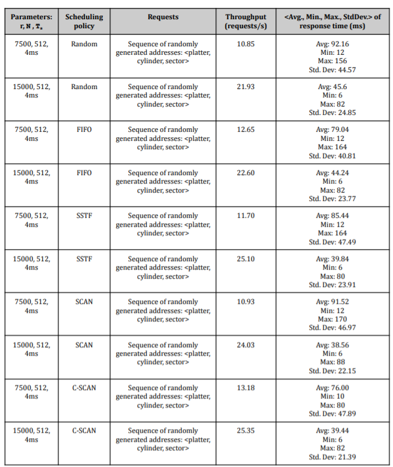

# Simulating-Different-Disk-Scheduling-Policies-in-an-OS
A C Program to simulate and compare different disk scheduling policies (Random, FIFO, SSTF, SCAN, C-SCAN) on a disk scheduler in an operating system.
<h4>What does the program do?</h4>
The program simulates the working of a disk scheduler under different scheduling policies (Random, FIFO, SSTF, SCAN, & C-SCAN), in an attempt to explore different statistics with respect to response time over the initial randomly generated requests to compare the performance of the different scheduling algorithms being compared. The number of surfaces/platters, tracks/cylinders, and sectors per track of the simulated disk are fixed with values of 4, 25, & 20 respectively. Other parameters like rotational speed, average seek time to go between consecutive tracks (indirectly), and sector size are user-specified parameters from the command lines. After running the program and analysing the output statistics under different, appropriate test cases, analysis can be done to compare performance. 
<h4>Working of the Program</h4>
<ul><li>Initially, based on the user specified command line argument of the number of requests to be generated, all the requests to be serviced throughout the program are generated with random parameters regarding its surface, track, and size (in terms of number of number of sectors spanned), along with the starting sector in its track. All the requests can be accessed from two data structures, one with all the requests, ordered in the order of their arrival, and the other storing track specific request information.
<li>Then, all the requests are marked as unserviced, and those tracks having zero requests across all surfaces are marked serviced (for the sake of convenience). After that, all the requests are slowly marked as serviced at a track level (since all requests in one track over all surfaces are serviced together), as per the disk scheduling algorithm being run.
<li>As each request is being serviced, the access times are kept track of as per the formula:

    Ta = Ts + (1/2r) + (b/rN)
<li>Where Ta represents the access time, Ts the average seek time between consecutive tracks, r the rotational speed, N the number of byres on a track, and b the number of bytes to be transferred. The average seek time between two consecutive tracks can be approximated as (where Nt represents the total number of cylinders/tracks):

    (Ts)consec - avg = (3*Ts)/(NT-1)
<li>From the access times of all the requests calculated after servicing them using different scheduling algorithms, various statistics such as the minimum and maximum access time, the average and variance of the access times, and the throughput of all the requests, which are further used as metrics to compare the different algorithms.</ul>
<h4>Performance of  Different Algorithms and Parameters</h4>
After running the program multiple times for a total of 50 requests each time under different algorithms and parameters. The results of the same can be shown in the table made below

<h4>Comparing the Performance of the Different Algorithms</h4>
From the analysis carried out, though big generalizations cannot be made since only small scale simulations have been done, some inferences that can be made to compare the different disk scheduling algorithms run are:
<ul><li>Though the random and FIFO policies are more or less same in intuition and execution while handling a large number of performances, FIFO just slightly outperforms the random policies in almost all aspects including throughput, average access time, minimum and maximum access time, and even variance in access times.
<li>Between the SCAN and C-SCAN policies, the C-SCAN algorithm performs slightly better in throughput, average access time, and variance in access times, but the biggest takeaway is the much shorter maximum access times, which is expected due to the less tracks traversed on reaching the cylinder end in C-SCAN.
<li>SSTF policy works well on high average seek time values due to it having a better localisation, where it surpasses FIFO and even SCAN even when it fell slightly behind when the average seek time was less.
<li>CSCAN policy has the lowest standard deviation out of all the policies at all parameter levels again expected, because of high uniformity of moving across different tracks.</ul>
<h4>How do you compile and run the program?</h4>
To compile the code, a command of the following structure can be run:

    gcc main.c -o main.out -lm
And then to run the code, run the command:

    ./main.out [r] [Ts] [N] [a] [NoR]
r: Rotational speed of disk, r revolutions per minute)  
Ts: Average seek time between consecutive tracks in ms  
N: Sector size, N in bytes  
a: Algorithm to be used (0: Random ; 1: FIFO ; 2: SSTF ; 3: SCAN ; 4: C-SCAN)  
NoR: Number of Requests to be run  
An example of a command to run the code with arbitrary arguments would look like:

    ./main.out 7500 4 512 1 50
